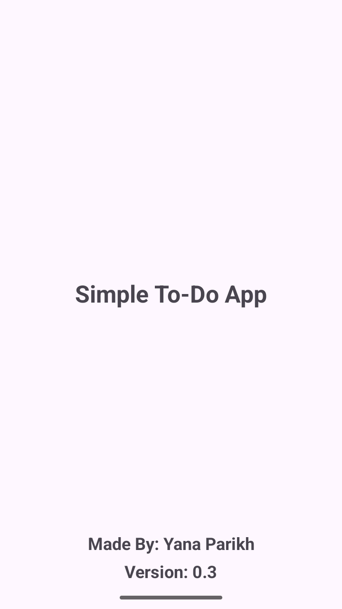
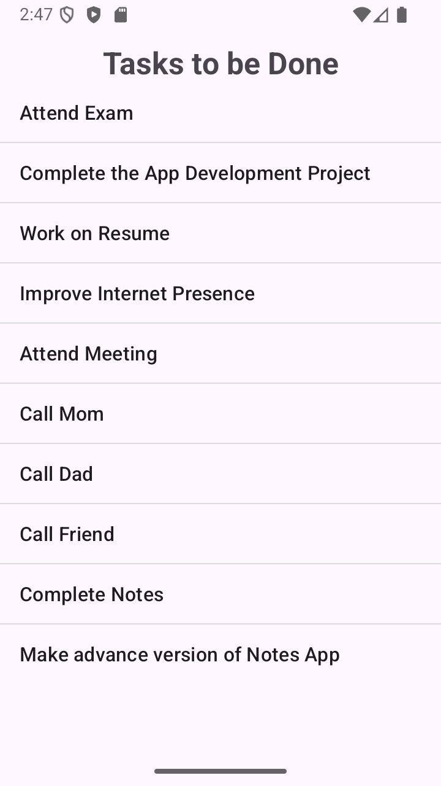

# ✅ Simple To-Do App  

📱 A lightweight Android application built to help users manage daily tasks.  
This project demonstrates basic Android development skills using Java and XML.

---

## 🚀 Project Overview  

Simple To-Do App provides a clean interface to display tasks.  
It was created as a learning project to understand Android UI design and app structure.

---

## ✨ Features  

- Simple task list  
- Clean and minimal UI  
- Scrollable layout  
- Lightweight performance  

---

## 🛠 Technology Used  

- **Java** – Handles app logic  
- **XML** – Designs app screens  
- **Android Studio** – Used to build and run the app  
- **Android SDK** – Android development tools  

---

## 📸 Screenshots  

  
  

---

## 👩‍💻 Developer  

**Yana Parikh**  
Android Developer | Web Developer  

🔗 LinkedIn: https://www.linkedin.com/in/yana-parikh-79040632a  

---
## 📄 License  

This project is licensed under the **MIT License**.

---

⭐ *This project showcases foundational Android development skills and serves as a stepping stone toward more advanced mobile applications.*
